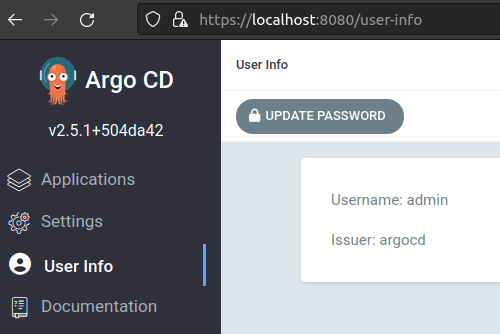

# Install ArgoCD locally from Helm chart

## Install Argo helm repo
```shell
helm repo add argo https://argoproj.github.io/argo-helm
```

## Build dependencies
```shell
helm dependency build helm/argo-cd
```

## Apply ArgoCD Helm charts
```shell
helm install argo-cd helm/argo-cd --namespace argocd --create-namespace
```

## Enter UI locally:

1. Port-forward argocd-server
```shell
kubectl -n argocd port-forward svc/argo-cd-argocd-server 8080:443
```

2. Navigate to https://localhost:8080

3. Admin credentials:
Username: Admin
Password: `kubectl -n argocd get secret argocd-initial-admin-secret -o jsonpath="{.data.password}" | base64 -d`

4. Change admin password:


## TODO: Test in EKS

# Install Argo workflow

TODO: I need someone that can provide helm chart to install workflow.
deliverable: README.md. - so i can deploy workflow on my existing cluster.

## If it's not installed already, Install Argo helm repo
```shell
helm repo add argo https://argoproj.github.io/argo-helm
```

## Build dependencies
```shell
helm dependency build helm/argo-wf
```

## Apply Argo Workflow Helm charts
```shell
helm install argowf helm/argo-wf --namespace argo --create-namespace
```

## Enter UI locally:

1. Port-forward argo-workflows-server
```shell
kubectl -n argo port-forward deployment/argowf-argo-workflows-server 2746:2746
```

2. Navigate to https://localhost:2746

## Install Argo CLI to interact with Workflows
https://github.com/argoproj/argo-workflows/releases/tag/v3.4.3

For Linux:
```shell
# Download the binary
curl -sLO https://github.com/argoproj/argo-workflows/releases/download/v3.4.3/argo-linux-amd64.gz

# Unzip
gunzip argo-linux-amd64.gz

# Make binary executable
chmod +x argo-linux-amd64

# Move binary to path
mv ./argo-linux-amd64 /usr/local/bin/argo

# Test installation
argo version
```

## Service Account to use Argo Workflows
SA: argo-workflow
Role: argowf-argo-workflows-workflow
RoleBinding: argowf-argo-workflows-workflow

## Run Argo Workflow
```
argo -n argo submit base-workflow.yaml --serviceaccount argo-workflow --watch
```

## Argo Workflow Useful commands
```shell
# List workflows
argo -n argo list


```